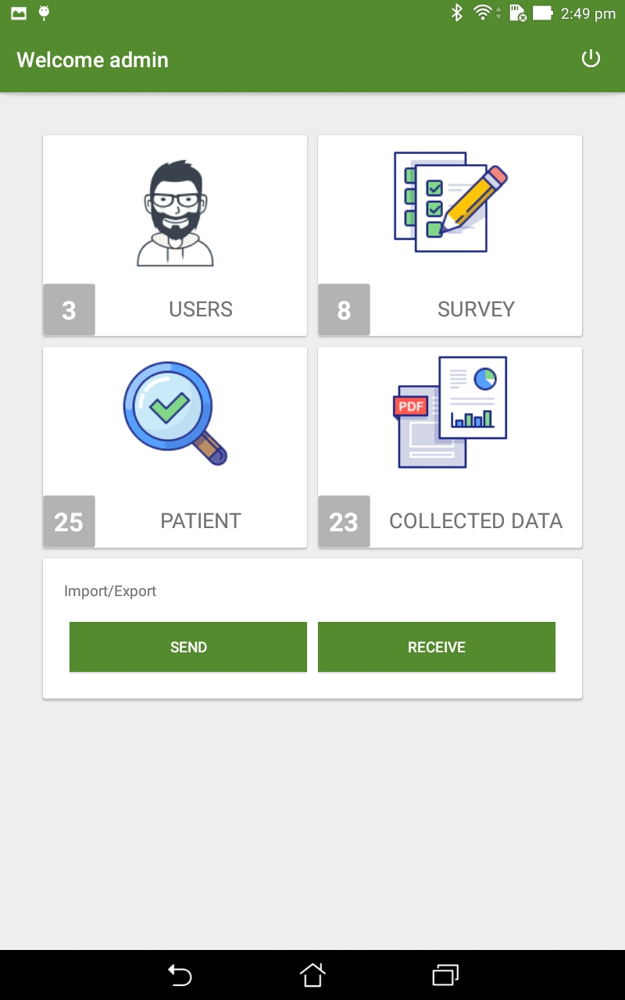
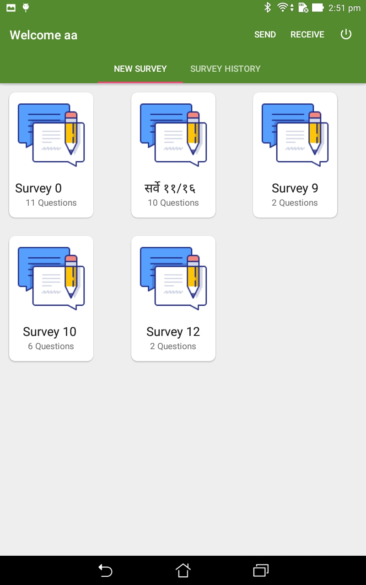
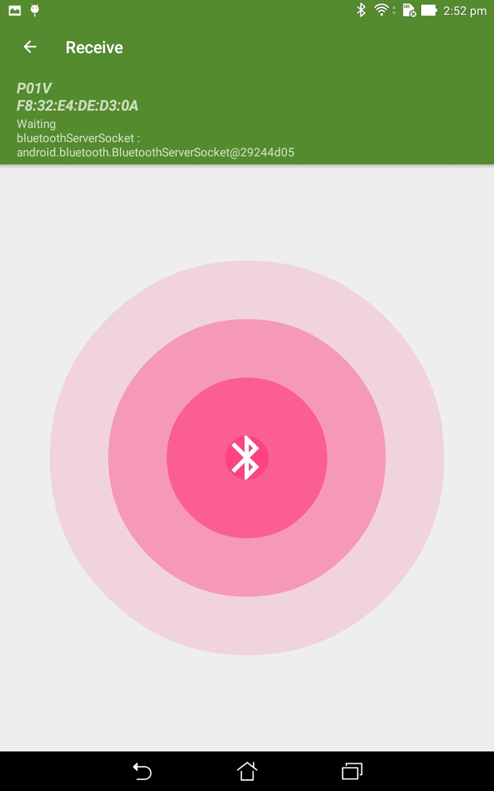
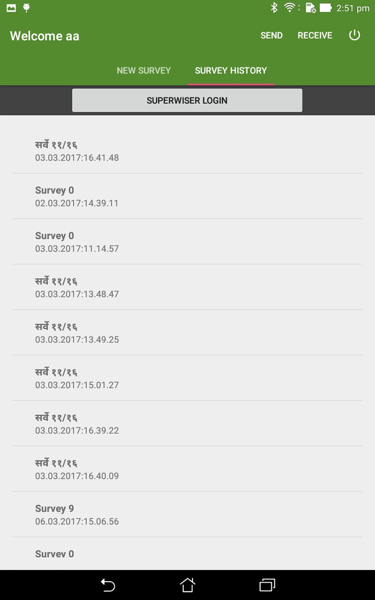

# Survey Collection

This is an Android application where user can create and collect the survey.

# Feature

- add three type of user (`Admin`, `Supervisor`, `Fieldworker`).
- Offline data collection
- support Several type of questions (`Text`, `Integer`, `Date`, `Time`, `image`, `patient data`, `single choice`, `multichoice`, `conditional`).
- Sharing of data (`via bluetooth`).
- Multilanguage Support (`Marathi`, `English`).
- Export collected data into csv file.

# ScreenShot

# App Demo Video

# Thanks

- [Realm](https://github.com/realm/realm-java)
- [butterknife](https://github.com/JakeWharton/butterknife)
- [Parceler](https://github.com/johncarl81/parceler)
- [opencsv](http://opencsv.sourceforge.net/)

# Contributors

- [Akshay Toraskar](https://github.com/AkshayToraskar)

# Contact Me

- Email: aksh.planet@gmail.com

